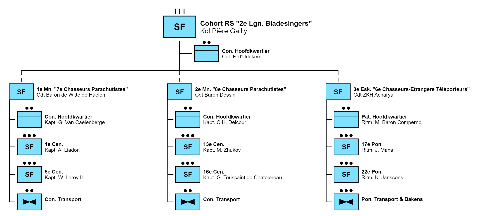

The 3rd Special Reconnaissance Squadron was created to strengthen the special operations capabilities of the High Kingdom Elven army. The squadron carries out reconnaissance missions, raids, sabotage and, if necessary, extraction of high-ranking individuals behind enemy lines. The III/1RS is made up entirely of non-citizens of the High Kingdom. In addition to being able to move on horseback, unique to the 1RS, the squadron also has the ability to teleport using Teleporter Beacons or to be deployed with spelljammers as air cavalry.

## History
The squadron will inherit the traditions and regimental colour of the 6th Cohort Etrangère de Chasseurs Téléporteurs, an old disbanded unit of the 2nd Legion of Bladesingers that has not existed for several centuries. The 6th Cohort Etrangère Chasseurs-Téléporteurs was founded as the 6th Cohort Chasseurs d'épée à cheval as part of the 2nd Legion where it was involved in many battles in the 1st and 2nd Unification Wars. After the Unfication Wars the 2nd Legion was largely disbanded but the 6th Cohort Chasseurs d’épée à cheval remained as one of the teleporter units – and was renamed the 6th Cohort de Chasseurs-Téléporteurs – of the legion using the first version of the Teleporter Beacons instead of always having to travel on horseback. Due to many budget cuts over the years the cohort was disbanded and its colour was placed in the Royal Archives. Her colour bears many mentions including:

* Reigersvliet
* Starmantle
* Evereska
* Passendaele
* De Geete
* Imjin

In addition, the colour also bears the blue pins of the Order of Corellon and the platinum pins of the Order of Bahamut as well as the Knight's Cross of the First Class. As a result of the expansion of the Special Forces Corps, a third special reconnaissance squadron was established and designated as the foreign squadron.

## Organization of its mother unit

 